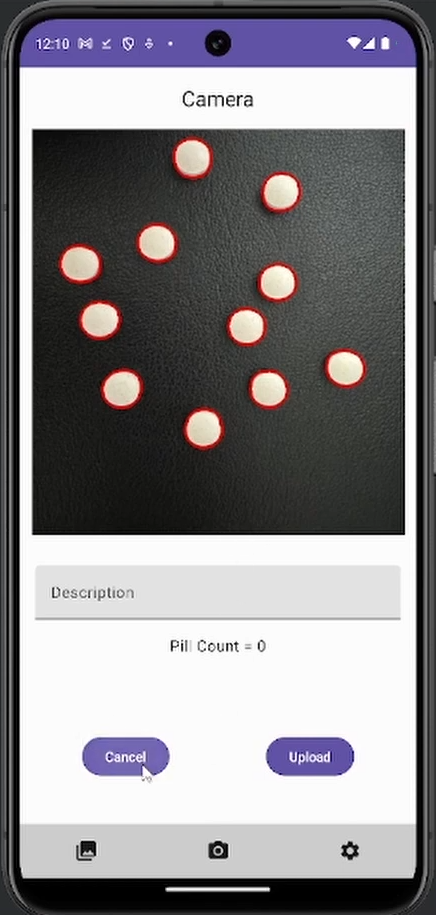
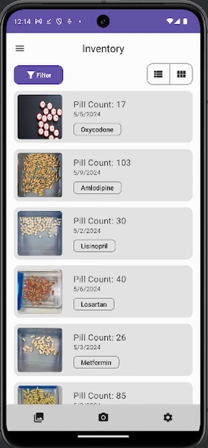
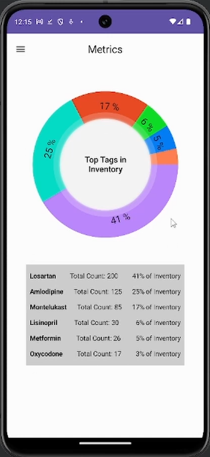
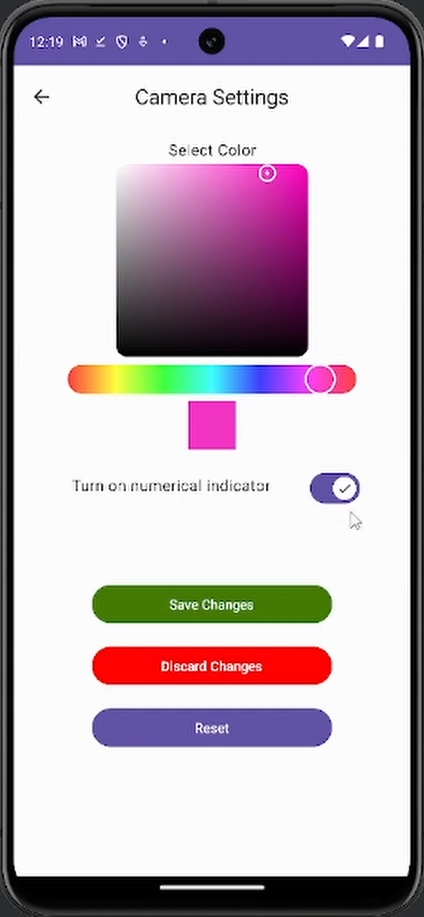
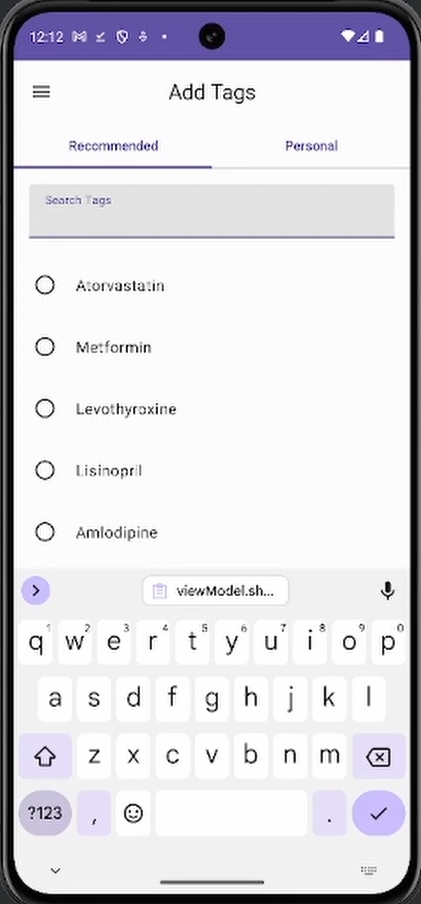

# Pillventory App

This Android app simplifies the process of counting pills and managing medication inventory. It's built using Android Studio, Kotlin, and Firebase for data storage and synchronization.

## Key Features 
- Automatic pill counting:
  - Count pills effortlessly by taking a picture with the app's camera or uploading an image from your phone's gallery.
  - Leverage image processing technology for accurate pill detection and counting.

- Visual inventory history:
  - Browse past pill counts like a photo gallery, with each count displaying the captured image, pill count, and associated tags.

- Comprehensive filtering:
  - Sort and filter pill counts based on various criteria, including pill tags, date counted, or specific medication names.

- Customizable camera settings:
  - Adjust the pill indicator on the pill count image to ensure optimal visibility and accuracy.

- Flexible tag management:
  - Create and manage tags for pills, such as medication names, dosage, notes, or other helpful reminders.
  - Easily add, remove, or edit tags to organize your pill counts effectively.

- Firebase integration:
  - Securely store and sync pill count data across multiple devices for seamless access.

## App Screenshots

  
  
  
  
  

## Getting Started
1. Prerequisites:
    - Android Studio installed
    - Firebase account and project set up
    - Installing dependencies
      - Python 3.8.0 https://www.python.org/downloads/release/python-380/
2. Clone the repository:
`git clone https://github.com/burntchow/pillventory-sp.git`

3. Connect to Firebase:
  - Add your Firebase project's google-services.json file to the app's app directory.

4. Build and run:
  - Open the project in Android Studio and build the app.
  - Connect an Android device or use an emulator to run the app.
 
